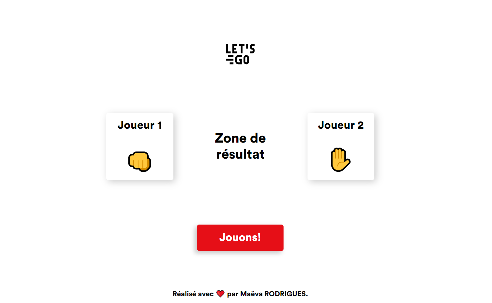

# Rock, Paper, Scissors game

What is it!? A simplified version of Rock, Paper, Scissors! Reactive button to play and restart the game. Conditional logic to determine who wins the game!

## 🌐 Technologies appliquées

- 

## 🛠️ Outils

- 

## 📷 Captures d’écran

## 🔗 Liens vers la démo
https://maeva-rodrigues.github.io/Mental_Arithmetic_App/

